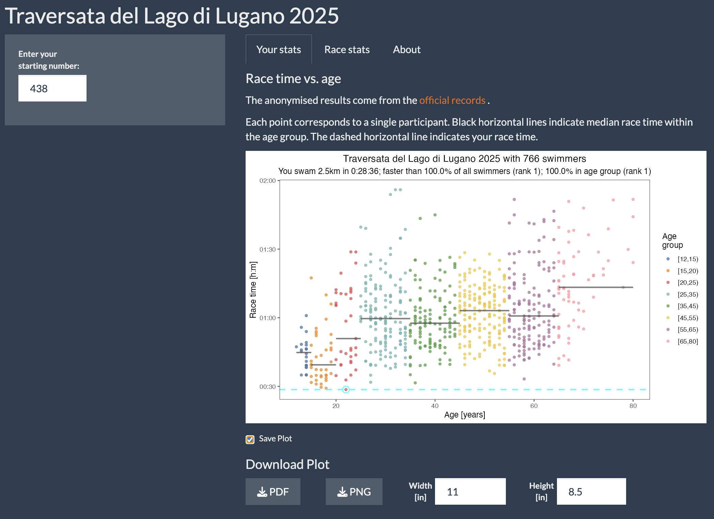

# Race Results Browser
Source code of the results browser of the 2025 crossing of the Lugano Lake, [Traversata lago di Lugano](https://traversatalagolugano.ch).

Browse the results online [here](https://macdobry.shinyapps.io/traversata-app/)!

## Data source

The results are anonymised (no first and last name) from the [official records](https://www.endu.net/it/events/traversata-lago-lugano/results).

## Running the browser locally

The app works on all major OS (Windows, macOS, standard Linux distributions) and only requires a recent R installation on which the standard package `shiny` is installed. 
Instructions to install R can be found on the official [R-project website](https://www.r-project.org/). 
Once R is installed, one can install the `shiny` package by typing: `install.packages("shiny")` in the R console.

For new R users, once you have installed R, we recommend to use R from Rstudio. 
It provides a programming interface and makes it easier to run the results browser. 
Instructions for installation can be found on the [Rstudio website](https://rstudio.com/).

#### Install and Start the App
First, download the latest version of the app directly from the [GitHub repository](https://github.com/dmattek/shiny-timecourse-inspector)(green button *Clone or download*, download as zip). 
Unzip the folder and place it in your favorite location.

If you have installed RStudio, launch it and go to *File -> Open Project*. In the contextual menu navigate to the location where you placed the app and open the file `traversata-app.Rproj`. 
This will load the app in the current Rstudio session. 
To start the app, open the `server.R` or the `ui.R` file in the Rstudio session, then click the *Run App* button with a green triangle in the upper right corner of the window with code open.
